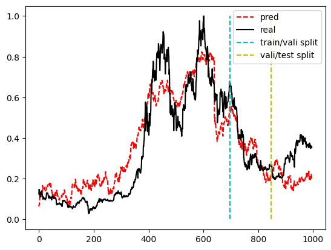
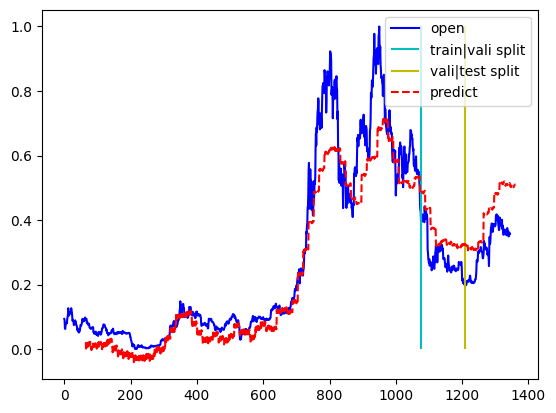

## 虚拟货币价格预测
[English](./README.md) | 简体中文
### 项目简介
本项目是一个基于深度学习的虚拟货币价格预测项目，通过爬取公开数据信息，获得了关于比特币的市场，新闻，美国互联网巨头公司的股票及市值，在数据清洗（异常值剔除，缺失值填补）后，采用了多个预测模型对比特币价格进行预测，最终得到了较为准确的预测结果。
### 项目数据来源
- 比特币价格数据：[https://www.coindesk.com/price/bitcoin](https://www.coindesk.com/price/bitcoin)
- 比特币新闻数据：[https://www.coindesk.com/news](https://www.coindesk.com/news)
- 市场情绪数据：[FearGreedIndex](https://api.alternative.me/fng/?limit=2000&date_format=us)

- 美国互联网巨头公司的股票及市值：[https://finance.yahoo.com/quote/GOOG/history?p=GOOG](https://finance.yahoo.com/quote/GOOG/history?p=GOOG)
- okx交易平台数据 ：[https://www.okex.com/](https://www.okex.com/)
### 项目结构
项目分为数据获取以及模型预测两部分
- 数据获取
    位于[`datasets`](./datasets/dataGain.py)文件夹下
    - 数据爬取
    - 数据清洗
    - 保存数据
        - [BTC价格及市场数据](./datasets/demodata.csv)
- 模型预测
    位于`simplemodel`文件夹下
    - 通过关联分析，提取数据集中的有效信息，再利用MLP 线性模型进行预测[代码](mlp.ipynb) 
    
    - 采用卷积神经网络利用市场，新闻情绪等数据进行预测([代码](longtermprediction.ipynb))
    
### TODO
- [x] 数据爬取
- [x] 数据清洗
- [x] LSTM对纯历史价格进行预测
- [x] 通过关联分析，提取数据集中的有效信息，再利用MLP 线性模型进行预测
- [x] 采用卷积神经网络利用市场，新闻情绪等数据进行预测
- [ ] 采用LSTM对市场，新闻情绪等数据进行预测
- [ ] 高频数据预测
- [ ] 交易策略，以回报率为指标

## 说明文档
阐述解决的任务，任务的挑战，问题的难点，遇到的问题以及技术路线和解决方案（实现细节）。

### 任务的挑战与难点
- 对数据的理解——虚拟货币市场具有强随机性，要理解价格波动的原因，从而推断有哪些数据是关注的重点
- 对预测因子的挖掘——了解其他市场信息
- 数据的爬取--- 如何找到公开的数据，或者是隐藏在图表中的潜在信息。
- 模型的选择——选择何种模型，能够较快速准确的获得模型的特征。
### 遇到的问题及解决方案
| 问题 |解决方案|
| :---: | :---: |
| 数据爬取时一般只能获取较短时间范围内数据，数据量明显不够 | 通过爬虫爬取数据，但是凭单个链接爬取的数据不全，因此需要改变爬取的时间范围 |
| 数据中有一定缺失值 | 通过pandas库对数据进行清洗，剔除异常值，填补缺失值 |
| 计算金融指标。金融指标因子很多，也不知道哪些是重要的，哪些对模型的预测性能提升有帮助。| 找到了一个专门计算的库，并且通过时间序列的延迟相关性分析了每个指标的贡献，最终选取了一些贡献度高的指标。 |
|- 初步尝试单靠历史数据本身很难预测得准确，可能是因为虚拟货币本身具有极强的随机性，不管在什么时间跨度上，即不管时间分辨率多大，数据的时间上的自相关联系很小，因此搜索了大量有关虚拟货币预测的方法。| 挖掘其他市场信息，发现虚拟货币与互联网公司的股价等有较高的关联性。 同时还找到了市场情绪指标，以及新闻情绪指标，这些指标都是可以爬取一些网站获取|
|预测模型太大，难以跑动。像transformer这样的大模型囿于机器性能，无法充分训练数据集｜ 因此转而找向轻型的预测模型，如mlp,CNN,rnn等｜.
## 技术路线和解决方案（实现细节）
### 数据获取
- 通过爬虫爬取数据，但是凭单个链接爬取的数据不全，因此需要改变爬取的时间范围
- 通过pandas库对数据进行清洗，剔除异常值，填补缺失值
- 找到了一个专门计算金融指标的库，然后通过时间序列的延迟相关性分析了得到的数据集中相关度比较高的贡献，最终选取了一些贡献度高的指标。
- 采用了两个模型来预测
1. 通过关联分析，提取数据集中的有效信息，将特征数据再利用MLP 线性模型进行预测：
设数据集为$D=\{X^t_i,y^t\}_{t=1}^n$，其中$X^t_i$为时间t的数据，$X^t_i$为特征数据，包含了市场，新闻情绪等数据，$y^t$为要预测的比特币价格。将数据归一化后，首先计算时间延迟相关性。设时间延迟为$k$，选择特征$x^{t}_i$,则时间延迟相关性为$c_k=\sum_n x_i^{n+k} \cdot \bar{y}^t$,计算得到最大的k，即为特征i的时间延迟$k_i = argmax_{k} c_k=\sum_n x_i^{n+k} \cdot \bar{y}^t$。
然后将特征i推迟k_i，得到新的特征数据$X^t_i = X^{t-k_i}_i$，再利用MLP 线性模型进行预测 X与y的关系。

2. 另一个是采用卷积神经网络利用历史多个时间窗的数据进行预测。其结构如下图

### 模型效果
- 通过关联分析，提取数据集中的有效信息，再利用MLP 线性模型进行预测中，归一化后数据预测的MSE为0.02左右，效果如下图。

- 采用卷积神经网络利用市场，新闻情绪等数据进行预测中，归一化后数据预测的MSE为0.01左右，在历史时间窗为64，预测时间窗为16的情况下，效果如下图

- 后续将尝试更多的方法，以及制定交易策略，以下游任务来评估预测效果。
### 感悟和收获
- 此次我选择的任务属于慢工出细活类型且工作量巨大。许多操作都有多种选择，但是囿于时间精力只能选一种。另外，当数据繁多时，容易搞混。有时一个小错误或者不恰当的方法可能很难发现，但是却在后面才发现，以致要花很多时间检测和完善。前几次尝试效果都不好，容易造成一种“虚拟货币无法预测”的挫败感，所幸后来还是没有以结果为王，一直完善和修改，希望后续能以交易策略来检测评估预测效果。
- 更好的预测指标可能是波动情况以及汇报率。
- 神经网络很多时候其实没必要引入非线性，可以先用线性模型试试，有时多层线性模型的效果可能比加入非线性的模型好。